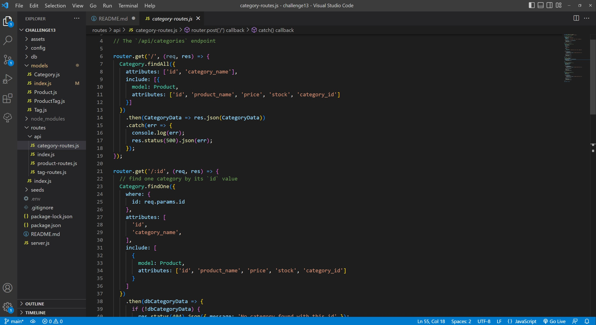
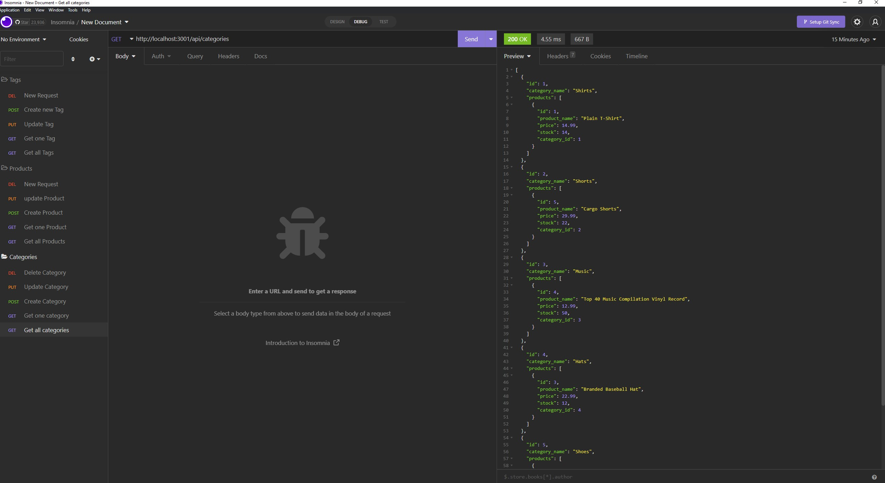

# Chazs E-commerce-Back-End

## Descripton
A back-end application that uses Express.js API and configure it to use Sequelize to interact with a MySQL database.
https://drive.google.com/file/d/1Hbnafw_dg-SK7401_tcCornygZpwAbDz/view

## Table of Contents
  * [Installation Instructions](#installation-instructions)
  * [Application Usage](#application-usage)
  * [Contributors](#contributors)
  * [Licenses](#licenses)
  * [Tests](#tests)
  * [Contact Me](#contact-me)

## Installation Instructions
Before running this application you must install -please npm install/npm install dotenv/npm install express sequelize mysql2

## Application Usage
-The usage is to keep track of an employers employees through the use of databases.

## Contributors
By Chaz Graham

## Licenses
This application is licensed under: None

## Tests
To test application open the console and run the following comand: none

## Contact Me
If you have additional questions you can contact me at https://github.com/chazgraham